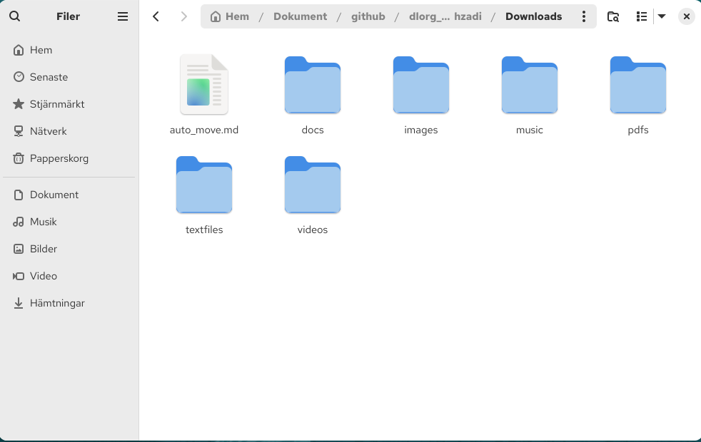
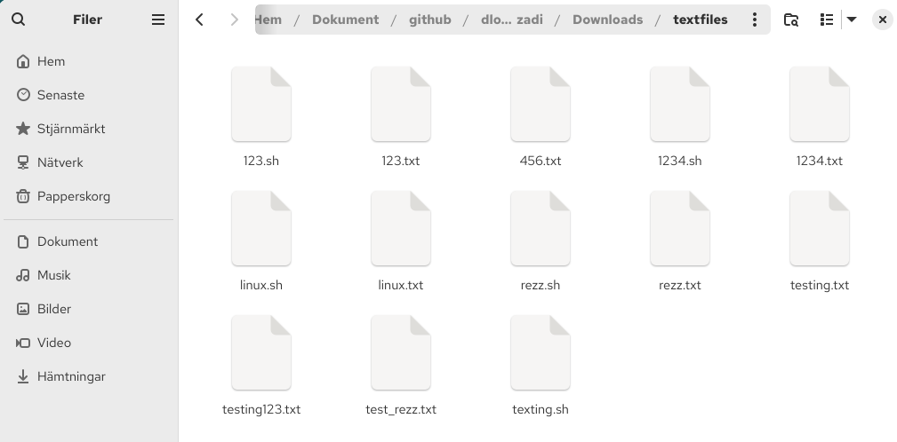
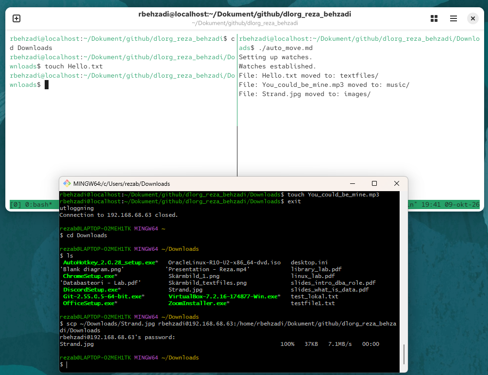
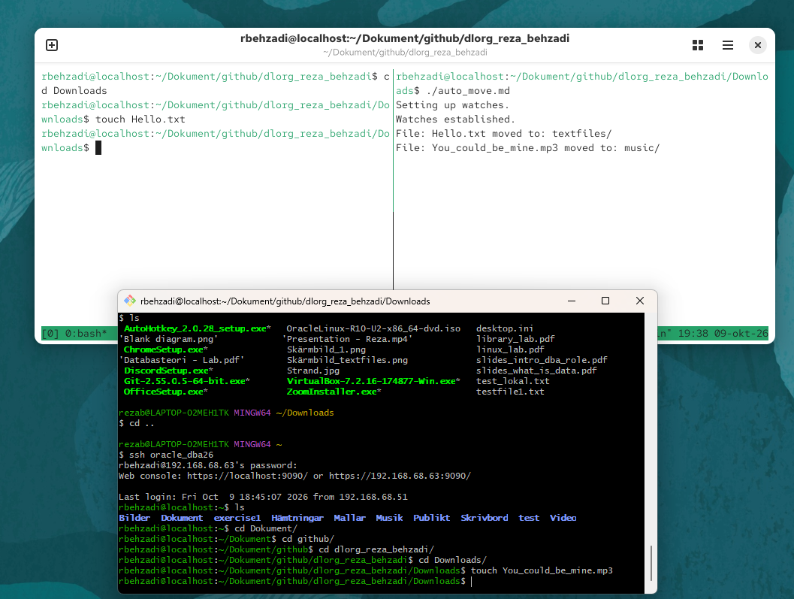

# Instruktioner till Linux lab:

Skriva skript som automatiskt sorterar filer i directory "Downloads" av olika format och flyttar dem till respektive directory:

- textfiler av typen .txt och .sh ska hamna i mappen "textfiles"
- filer av typen .docx ska hamna i mappen "docs"
- filer av typen .jpeg, .jpg, .png och .gif ska hamna i mappen "images"
- pdf-filer ska hamna i mappen "pdfs"
- ljudfiler av typen .mp3 och .wma ska hamna i mappen "music"
- videofiler av typen .mp4, .mov, .avi och .wmv ska hamna i mappen "videos"

